昨夏。1年が経っても音MDM天の興奮は冷めやらず、それに影響を受けたイベントが企画されていた。

コミュニティの規模も拡大し、活気に満ちていたその頃。「仲の良い者同士でコンビを組み、それぞれが目指す音MADを完成させ、一斉に投稿して界隈の注目を集める」というコンセプトの企画が立ち上がった。
 
コンビの結成は本家のような指名制ではなく、主催が組み合わせを決める形式だった。「その人ならこの人との音MADが見たい」といった意図によるもの。
 
コンビ発表の日、相方とどのような作品にするか話し合った結果、かねてより私がオリジナルのメドレーを作りたいと考えていたこともあり、メドレー合作という形で制作することになった。
 
天邪鬼（逆張り気質）な私は、あえて人気曲中心のメドレーとは違う方向を目指し、自分の好きな曲だけで構成することを決めた。

後日。年末投稿を目標に、意気揚々と、あるいはどこか気の抜けたまま制作を進めていたところ、突如として事件が起こり、紆余曲折。
 
相方を欠いたコンビでの制作は困難となった。悪い報せは他の参加者のモチベーションも削ぎ、私自身も意欲を失ったまま、気づけば師走を迎えていた。
 
無事に投稿まで辿り着いたコンビもあったが、企画の当初のコンセプトは崩れ、やがてその存在感も薄れていった。

年末。私の熱意は冷めてしまったものの、編曲途中で止まっていたメドレーをどうするか考えていた。
 
せっかく着手したものをそのまま終わらせるのは惜しく、コミュニティから参加者を募って合作にすることを思いつく。「音MADを本気でやりたい人は反応してください」と投稿したところ、多くのメンバーが応じてくれた。
 
年始、対象者に招待を送り、不足していた人数は参加者の協力も得ながら集めていった。
 
そして招集が一通り完了したのち、メドレーの編曲も完成へと至った。

選曲基準は大きく二つ。ひとつは単純に自分の好きな曲であること。もうひとつは前後のパートに何らかの繋がりを持たせられること。曲名の共通点やメロディの類似などから関連性を見出している。
 
ゆえにタイトルは『ランダムな文脈』、すなわち『RandomContext』とした。

# 　

##### 01. イザヨイレイバーズ | とりねこ

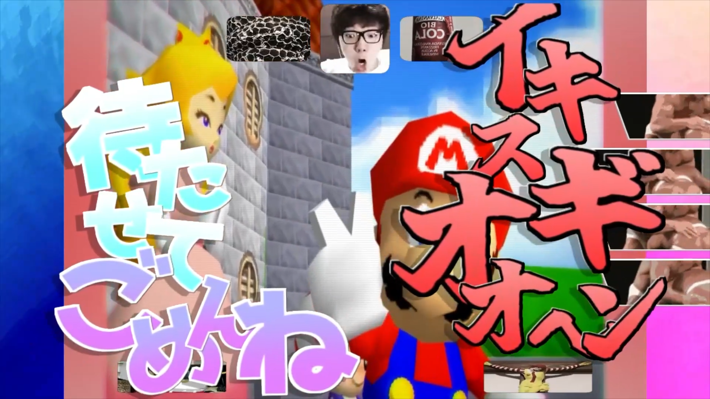

とりねこって私的オールスターこんなんなの？エグいてぇ
 
曲はSoundCloudからピックしました

##### 02. SH4PESHIFT3R / New York Back Raise | 64

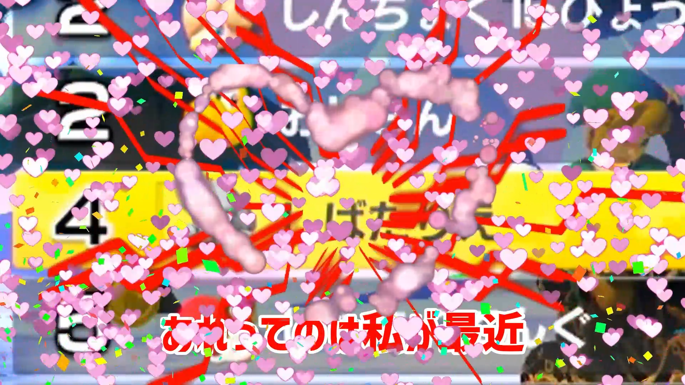

64の特異性が現れている素材群で非常に新鮮で、非常においしい。目に悪い
 
BOFETから選曲。ちっちゃいころから好きなんすよね、kei_iwata

##### 03. フィクサー | ばーこーど

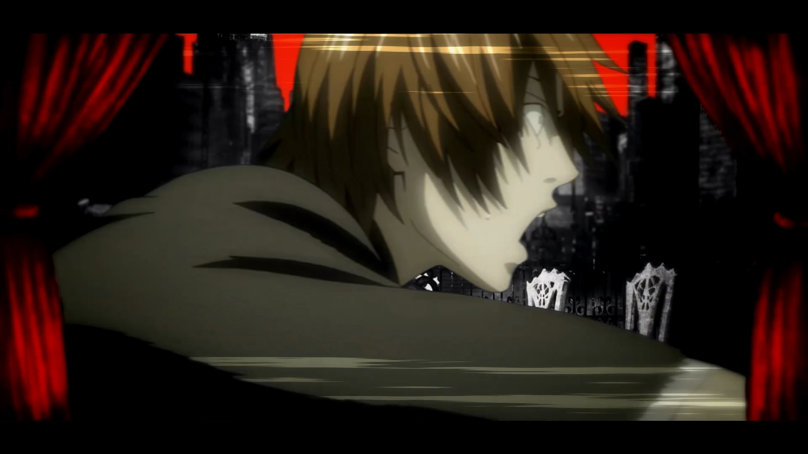

フィクサーの曲調と夜神月のダークさが同調しておりプーさんを蹴っている
 
カカオビターで済ませてはならない

##### 04. HETERODOXY | 焙煎黒豆汁

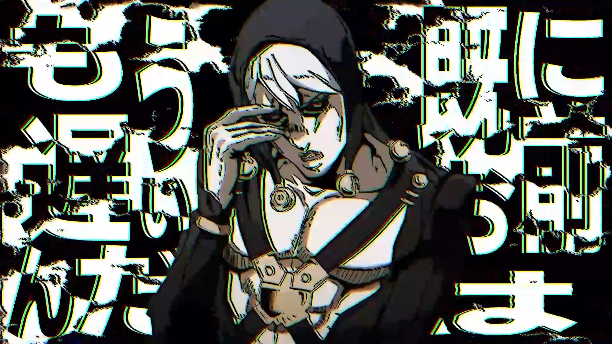

前パートと連続して曲調とメタリカがマッチしており、しっとりとしていてそれでいてベタつかないすっきりした編集だ。
 
ソフトはAfter Effectsを使用したのかな？

##### 05. Invisible Frenzy | カ得る

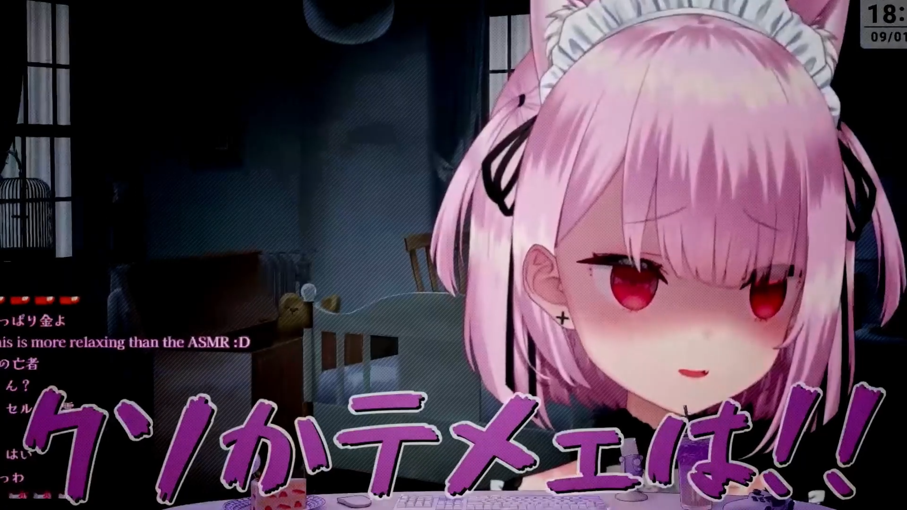

音圧がやばくて気　　持　　ち　　良　　い
 
提出された音声の中でも群を抜いて海苔だった

##### 06. "Libera me" from hell | Tatsuya

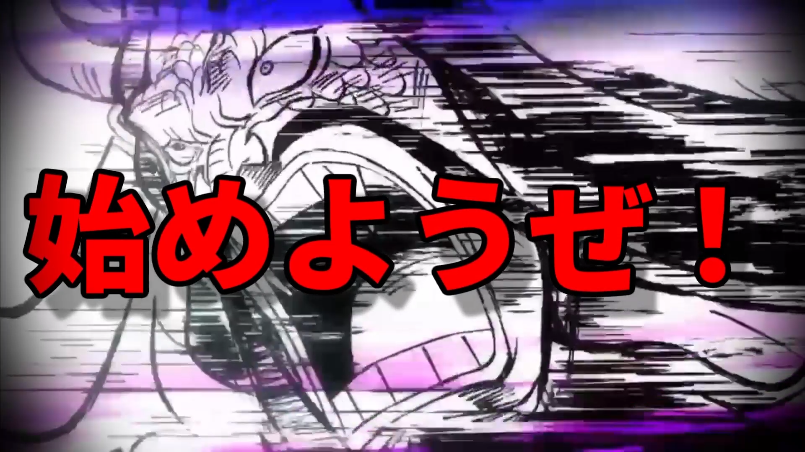

合作企画前、相方からリクエストされた曲（パート担当者とは別人）
 
大きさ比較シリーズと文脈が繋がっていて好い参照ですね

##### 07. Rumor / Squid Game vs. MrBeast / Abendo | ざびむ

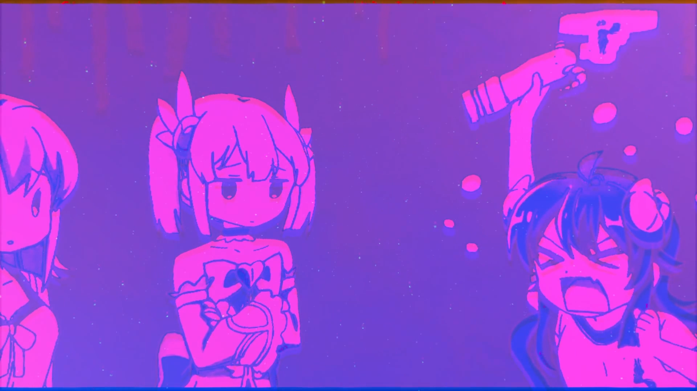

確かここは線形的にBPMが向上していた気がする。お手数をおかけしました
 
Rumorは<a href="https://www.youtube.com/watch?v=2AGB9ubxlTw">これ</a>を見て入れたくなった。AbendoはBOFXVIで最も好きな曲です

##### 08. Rainbow Treasure | Nob

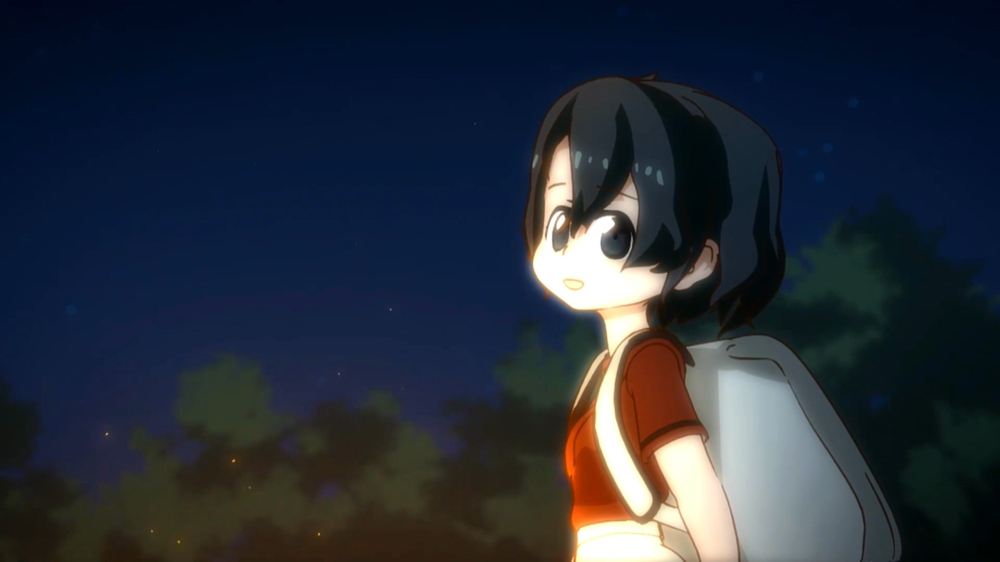

学生時代に金欠でMSGS音源に頼っていた頃に聴きかなり衝撃を受けた曲
 
けもフレの例の回にフォーカスしておりあぁ＾～いいっすね＾～

##### 09. 六兆年と一夜物語 | cloudy

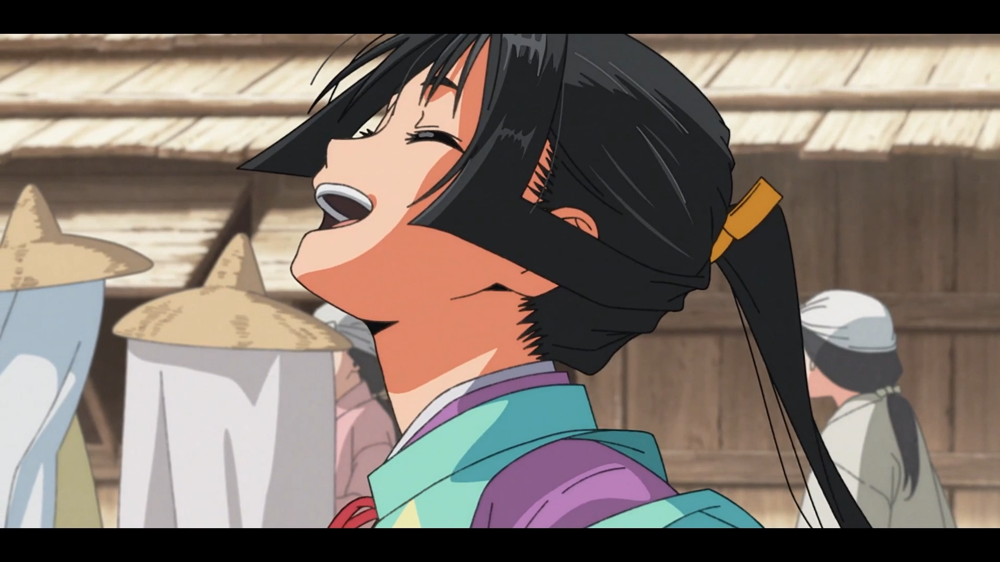

音声のクオリティは高く映像も<a href="https://www.nicovideo.jp/watch/sm43745445">合作の構想元でありリスペクト先</a>に則って編集されており私の展望を明確に受け取ってくれています
 
ひろゆき、メドレーのサムネに入れて貰うことできるか

##### 10. 林檎華憐歌 | たっつぁん

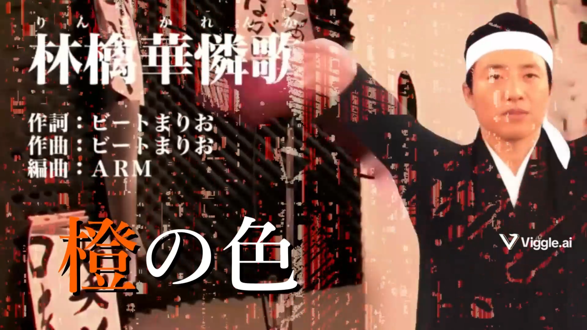

歌詞を一部改変したり歌詞から修造への共通項を見出したりと
 
たいへんポッシブルな出来でございました

##### 11. THE APPLE IS CAST! | チョコ味バームクーヘン

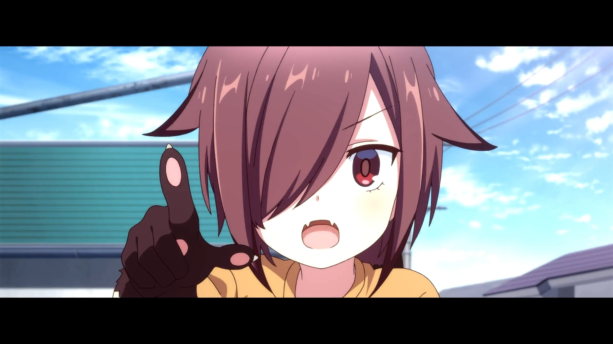

このキャラクターは何て言うんですか？（獣の巨人）
 
おそらくストーリーの結の部分に着目しており、短い秒数ながらうまくまとまってて才能アリ

##### 12. Bad Apple!! | いよかん

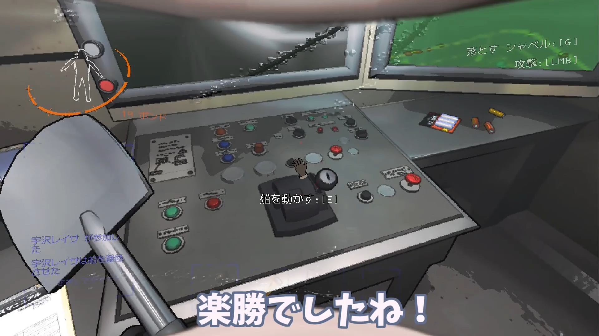

台詞合わせに疾走感がありうまい
 
てか50人リーサルカンパニーまだ？

##### 13. SHELLF!RE OF RETVIZAИ | 不学

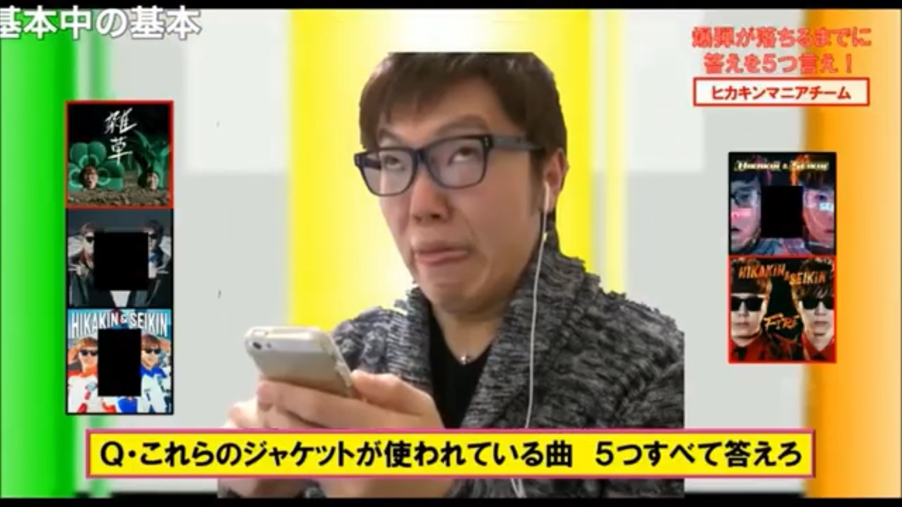

抜ける👍

##### 14. 泡沫の灯 | ぽぽ…ぽぽぽ……

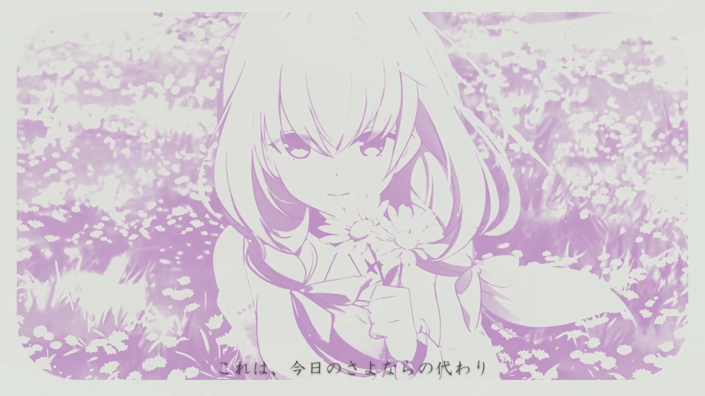

Endorfinで一番好きな曲
 
曲の印象とマッチしたしめやかな音声と映像は非常にもう、ひじょーに先生向け

##### 15. \[Nexus\] / MY FIRST YTPMV | くにゃ

最後神
 
\[Nexus\]はosuで好きだったので選曲
 
My fisrt YTPMVまさしくだいたいが音スタダ参加者なので選曲した

# 　

音MADは趣味であり義務ではない。そのため期日を過ぎても提出されないパートもあった。
 
しかし期日を延ばせば、合作自体が曖昧に終わる可能性が高いと判断し、締切は据え置いた。未提出のパートについては特定の画像で差し替えることにした。
 
その画像が「さつまいも」である。

合作名は投稿直前まで決まっておらず、進行中に参加者同士で案を出し合っていた。その中でひときわ印象的だったものが、<a href="https://x.com/kbyr0/status/1890368791139193232">当時コミュニティ内で流行していたツイート</a>に由来する案であり、最終的にそれを採用した。